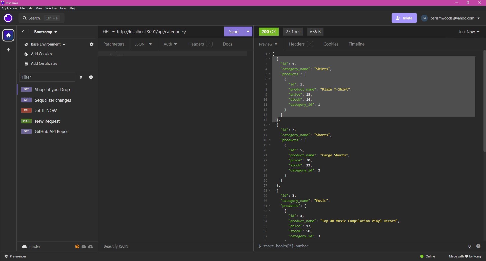
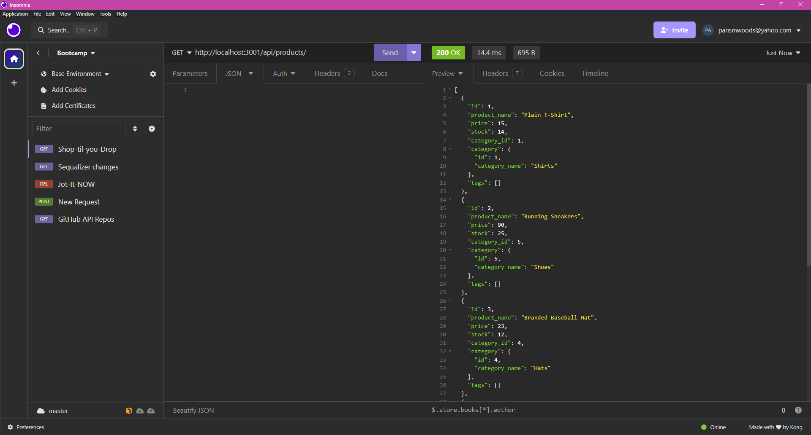
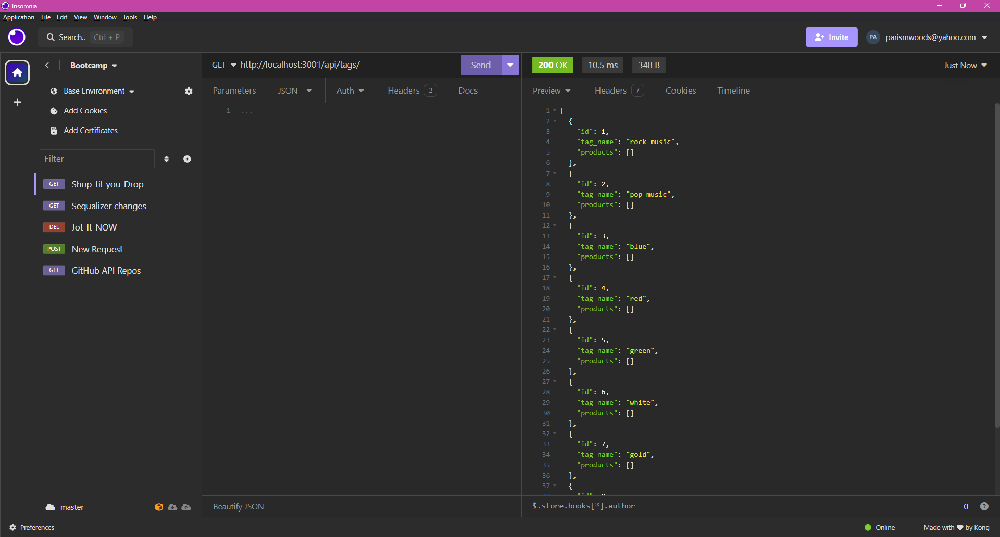

# Shop-Til-You-Drop
Back end developed for an internet retail company.

## Description
Shop-Til-You-Drop depicts a database developed for an Internet retail company that sells collections of clothing, music, and footwear. 

## Installation Requirements
This application requires the use of various npms including dotenv, mysql2, express, nodemon, and sequelize. The applications also requires the use of Insomnia for testing api routes.

## Usage
Connect to the mysql database using the information provided. Source the schema. Next, open the server in the and seed the models using “npm run seed.” Then start the server application using “npm start.”  After the server is started, open an HTTP request and get the data using the get option and port provided followed by either categories, products, or tags. To add new data use the post option. To update data, use the put option. And to delete data use the delete option. Note: Make sure the HTTP request includes the id of product when using the update or delete option.

### Link to Video
https://drive.google.com/file/d/16RhDwlsmSpLBISXFFlt8OwuBbJ_9-fEb/view

### Screenshots

